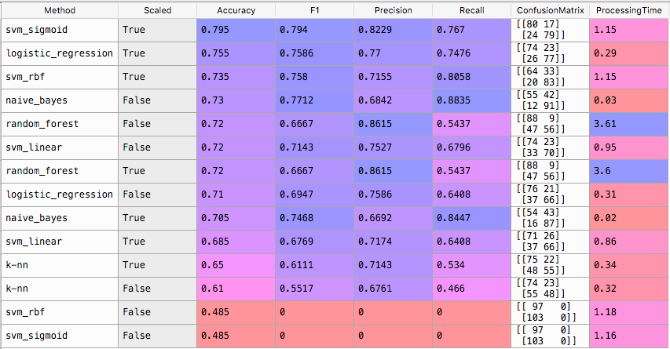

# NLP Bag of Words
## Fun with traditional ML algorithms
Check how effective "traditional" ML methods work in a simple context.
1000 restaurant customer reviews are classified as 1 or 0, "Liked" or "Didn't like".

To review the results, open the df_results after the script has run.

Based on an exercise of ML A-Z on Udemy (Superdatascience)

## Phase 1:
### Algorithms:
* SVM (linear, sigmoid and RBF kernels)
* Naive Bayes
* K-NN
* logistic regression

### Process:

The data is in the Restaurant_Reviews.tsv file

- Data loading into dataframes
- "stop words", the most common words, are removed from the reviews as they do not add value.
- "Stemming": related words/verbs are grouped together to get a more consistent result. E.g. all words like, likes, liked, liking, likable, etc. become "like".
- Resulting reviews are grouped into a rough "Bag of Words"
- Words are tokenized, keeping only the most used words are kept to reduce sparsity and computation cost of the classifiers. The result is de facto a very sparse matrix.
- This bag of words is processed with "traditional" ML techniques (with and without feature scaling). The training/test set sizes are 800/200 (80%/20% of the dataset)
- Ratings (0/1) are predicted on a test set of 200 reviews.
- Results are grouped in a table, sorted by descending accuracy. 

### Surprising results
The TOP 3:

1. SVM with sigmoid kernel and feature scaling
1. Logistic regression with feature scaling
1. SVM RBF with feature scaling

The SVM algorithm with Sigmoid kernel is actually both best and worst in class. With feature scaling, it achieves the best result with 79.5% accuracy.
Without scaling, it's broken and always predicts 0 (Didn't like) values, as shown in the confusion matrix.
Some methods perform better on a scaled input, others prefer the unscaled version.

The time is displayed in seconds.



### Phase 1 Conclusions
Almost 80% accuracy after training on a sample of 800 reviews, is surprisingly good!!
Specially with such a rough "bag of words" method, not taking into account the words order.
Now, that'd be nice to achieve a better accuracy, like 90%.


# Phase 2: Turbocharge the classifiers!
To achieve a better performance with my classifiers, I planned to train them on a bigget dataset.
I found this one, with around 82000 reviews, on [Kaggle](https://www.kaggle.com/c/restaurant-reviews/data "Restaurant reviews")
As it turned out, it didn't work as expected, and I learned a few things on the way.

This second dataset had around 82000 lines, and scores between 1 and 5.
So I set values so:
- 1-2 => 0
- 4-5 => 1.
- 3 => discarded: they can't really be considered as "liked" or not.

Doing so, it was quite an interesting exercise trying different configurations: vocabulary size (number of words considered) and training set sizes.

## Step by step execution
I first run the classifiers with different training and vocabulary sizes to get a rough idea of the performance.
Results after training on 5000 observations of the second dataset, and testing on 1000 observations of the first one


```
####################
START ML_LOOP
training set size: 10000
vocabulary: 1000
test set size: 1000 

METHODS: logistic_regression k-nn naive_bayes random_forest svm_linear svm_rbf svm_sigmoid 
SCALING: [False, True] 

METHOD               SCALED     ACCURACY   F1         PROCESSING_TIME
logistic_regression  False      0.671      0.7459     0.45
k-nn                 False      0.612      0.6381     14.49
naive_bayes          False      0.508      0.6702     0.2
random_forest        False      0.551      0.6901     30.22
svm_linear           False      0.673      0.7455     62.85
svm_rbf              False      0.5        0.6667     46.54
svm_sigmoid          False      0.5        0.6667     48.3
logistic_regression  True       0.673      0.7443     2.59
k-nn                 True       0.507      0.6698     14.23
naive_bayes          True       0.508      0.6702     0.15
random_forest        True       0.551      0.6901     29.56
svm_linear           True       0.678      0.7473     681.87
svm_rbf              True       0.588      0.7078     53.99
svm_sigmoid          True       0.592      0.7086     35.61

END ML_LOOP
####################
TOTAL CPU TIME: 1021.39

```
## First intermediate results
SVM linear and logistic regression look like promising classifiers.
- SVM linear is the best at this point, but its computation time gets problematic, specially on the scaled input.
As it turned out, I dropped it later because it was way too long to process.
- Naive Bayes is the fastest but really not accurate.
- Random Forest (500 trees) is a bit long, and not so accurate either.

Then I give all of these classifiers a new try with a bigger training set and vocabulary size:

```
####################
START ML_LOOP
training set size: 15000
vocabulary: 1500
test set size: 1000 

METHODS: logistic_regression k-nn naive_bayes random_forest svm_linear svm_rbf svm_sigmoid 
SCALING: [False, True] 

METHOD               SCALED     ACCURACY   F1         PROCESSING_TIME
logistic_regression  False      0.683      0.7514     0.62
k-nn                 False      0.521      0.6657     29.5
naive_bayes          False      0.524      0.6775     0.53
random_forest        False      0.552      0.6906     69.43
svm_linear           False      0.698      0.7565     236.88
svm_rbf              False      0.5        0.6667     155.64
svm_sigmoid          False      0.5        0.6667     167.2
logistic_regression  True       0.683      0.7482     5.39
k-nn                 True       0.526      0.4        28.45
naive_bayes          True       0.524      0.6775     0.46
random_forest        True       0.552      0.6906     68.7
svm_linear           True       0.713      0.7626     2230.51
svm_rbf              True       0.63       0.7291     288.79
svm_sigmoid          True       0.607      0.7167     106.57

END ML_LOOP
####################
TOTAL CPU TIME: 3389.59
```

## At this point:
 
- K-NN accuracy is getting worse with more data
- Naive Bayes still has a minor improvement, but is super-fast then cheap to keep
- Random Forest is stagnating around 51-53% and bit long to process => out
It seems reasonable to drop K-NN, Naive Bayes and Random Forest (acceptably fast but not accurate)
The execution time of SVM linear was OK on a non-scaled input
SVM linear "scaled" seemed to deserve a special treatment as it had the best prediction, but it gets so long to train that it's simply not possible to keep it.
- SVM Sigmoid happens to stagnate around 50% so out.
- SVM RBF without scaling is not good, with scaling OK.

And so on...

At the end the big winner is... **logistic regression**. SVM linear has better results at first but just doesn't scale up.

## Lessons learned

### First mistakes!
First, I mixed both datasets and trained and tested both classifiers on this.
This lead to amazingly good results, but it was not representative of the performance on the initial test set, what actually really mattered.

Second, I used the F1 score as main metric, accuracy turned out to be a better metric.

### Sparsity
The matrix after tokenization is definitely very sparse. The information density is very low.
The matrix size is HUGE compared to the information it contains. 
This leads to a longer computation time, as each cell has to be processed, whether it contains a dumb 0 or not.
Applying feature scaling changed the 0s by many mean values, but the information density was still the same (appalling).

I tried a "sparse" matrix format, but on this volume, it did not seem to make a big difference.
It made scripts more complex and Naive Bayes could not process those.

### Computation Performance 
The matrix size is basically training set size * vocabulary size. So it could vary from 1000 x 1000 (1 million cells) to 50'000 x 18'000 (900 millions cells!) depending on encoding choices.
Scripts happened to run quite long. So I ensured that intermediate results got printed during the processing.
It became my main tool to evaluate results.

First, running with around 18K words and not too small datasets, it took around 25 minutes to process all the methods.
I also logged the times, which happened to be a very useful information.

It was quite interesting to compare the evolution of the time of specific classifiers, depending on the input size.
SVM RBF and SVM Sigmoid seemed to be quadratic o(n2), K-NN linear, logistic regression and naive Bayes lightning fast whatever the input.
I didn't plan to really improve their speed, as I was mainly using standard parameters of these traditional algorithms.
Trying to writing them in Python was not an option, and their implementation in C/C++ was definitively better than what I could have done myself.

### Evaluation metric
At first I used F1 score to select the best classifiers. 
As the 0-1 class distributions are quite balanced in both datasets (around 40-60%), the accuracy is actually the best metric to use. 

### Dataset quality and distribution
Finally, I compared the data distribution:
- Liked scores: the second dataset had a relatively higher mean (0.67 vs 0.5) and smaller standard deviation (0.3 vs 0.5)
Indeed, the initial dataset was quite extreme in its values, 0 or 1.
- The second dataset reviews were also much longer, and a lot more vocabulary (18000 vs 1800).
It also contained sentences not related to the restaurant itself.
E.g. "after a long day blah blah ... then we found that restaurant, then <real start of the review>"

Basically, I trained my classifiers to shoot in a target (training set), and the test set target was somewhere else. The datasets at the end were too different.

So the naive assumption that training ML classifiers on a bigger dataset would automatically bring better results, was indeed very naive.
Dataset quality matters!

## Phase 2 conclusions
Overall, I came to the conclusion that using this new dataset was not so great for training:
- In the best cases, both accuracy and F1 score very unsatisfying, specially taking into account the much higher training set size and longer processing time.
The performance was much better when training classifiers with only a part of the initial smaller dataset!
- One interesting fact, one of the most simple approaches, logistic regression, was always the fastest and generally with the best performance (most runs in a fraction of a second, 1000 times faster than others).
- Naive Bayes could also have had a decent result, and it was very fast compared to other algorithms. It makes sense to use it in some cases considering its performance.

# Phase 3: More research
Still somehow unsatisfied with these results, I wanted to find out if I could get better results, even though the chosen dataset was not the best one to train my classifiers.
I played a bit with the sparse matrix format for specific algorithms (except Naive Bayes which accepts only standard numpy matrices).
All in all, most algorithms didn't perform well when trained on the new dataset.

Logistic regression (scaled) and SVM linear (scaled) showed clearly the best results, depending on the training dataset and vocabulary sizes.
Logistic Regression was by far the fastest of both.

At the end I automated the tests with different settings (training set size and vocabulary size), so they can be called very quickly in a new context (new project or Hackathon).
One case could be Spam Recognition, where Naive Bayes usually shines.

I used this to test logistic regression with many different configurations, vocabulary size and training set size.

## Asymptotic complexity:
Logistic regression complexity is most likely logarithmic-like as doubling the size seems to translate to a constant increase of execution time.

SVM linear computation time is... very bad: from 10'000 to 20'000 lines, execution jumps from 25 to 321s.
This SVM linear provided by skikit seems to have beetween O(n3) and o(n4) asymptotic complexity.
I could not use it on even half of the whole second dataset because it was never completing.
It was a pity to discard it as it had regularly a better accuracy than logistic regression.
I'd still would like to find out, up to what point SVM linear still makes sense, and find its optimal performance.

The execution is generally slower when performing over a scaled input.


# Phase 3 conclusions
Logistic regression is by far the best combination of accuracy and running time. 
The best results I could get was 74.2%, with 35'000 observations, scaling and a vocabulary of 4500.

Overall, increasing the training dataset over a certain point seems to slightly decrease accuracy.
It suggests overfitting or dancing around a local optimum (as I would see it with a neural network and gradient descent).

- The winner in this specific context is Logistic Regression algorithm, though its accuracy is worse than in the first phase.
It is actually the second best, but by far the fastest.
SVM linear seems to be overall slightly better but its full potential cannot be used due to its awful computation time, which prevents training it on bigger datasets.
- All other algorithms, SVM RBF and SVM Sigmoid or the usually "hassle-free" Random Forests, and Naive Bayes, have a pretty bad performance, below 55%, maybe 60% at best with training/vocabulary sizes.
Overall not the best in this context.
- I quickly tried the polynomial SVM kernels, just in case it brings interesting results. 
The accuracy was a surprinsing flat 50% in all my tests, and the running time was consistently very long, so I didn't go further.
Now it's at least in the nlp_util file, usable on other problems.
- Feature scaling sometimes improves performance, sometimes not, depending on sizes.
I could find a kind of pattern with logistic regression, with scaling improving performance 2-3%... but not always.
So I keep both, though it significantly increases the processing time.

At the end I see here a second level problem: running scripts over these 3 independent factors: vocabulary size, training size, feature scaling yes/no, and finding out if a pattern can be found.
Can we find one or several local optima, a recommended size of vocabulary, where does feature scaling really help?
This would be a very interesting problem to solve, and very useful.


# Phase 4? Remaining questions
- Algorithms tuning: I took standard settings for each algorithms. 
I would be good to narrow down on specific algorithms and explore more the impact of different parameters, specially:
    - Number of degrees for SVM Polynomial
    - Distance type for Number of trees
    - Number of neighbors for K-NN

For the Random Forest, I took a "heavy" random forest with 500 trees. 300 would have been more standard.
If 300 trees gave correct results for a much shorter computation time, then it could be considered for higher volumes.
- Get more precise details on the computing time: pre-process the data, generating the spare matrix, fitting and predicting time.
- A small digression: compare the values of dense and sparse matrices formats, and display it nicely in a graphic.
It would also be interesting to check more precisely the impact on computation time.
- Store results from different settings in a single dataframe, including the run settings (train size, vocab size, scaling or not). 
- Test on EXACTLY the same test set of 200 observations, as when classifiers were trained only on 800 observations of the first dataset.
Just to be sure that this is not biasing the result.

## Next steps for improvement
I'll most likely not work further on this exercise. Please send me feedbacks if you do!

Basically, potential tracks for improvements I see are:

1. Add the accuracy on the training set to see if there is overfitting
1. Gather the result from a decently large sample of runs and find out the best settings, using a second level of ML algorithms (or why not a small NN). The most fun definitively.
1. Re-train on 800 of the first dataset + 5000-20'000 of the second one and check the results.
1. Find a relevant dataset with a good quality, and similar scale/distribution as the initial one.
1. Try with new classifiers
1. Of course the RNN NLP way: a simple recurrent neural network (RNN), next step with GRU cells.
1. Try different a fully different approach of bag of words: 2-grams or 3-grams would be promising

One very interesting thing to do, most likely not possible, would be to use a language encoding vector (e.g. Glove), as commonly used with NLP Recurrent Neural Networks.
So a sparse one-hot vector could be represented by a much smaller vector and the computation time would be much better.

# Last but not least
## New experiment: integrate the "undefined" *** scores
As I was doing minor changes on scripts, came a dumb idea: what about the 3* ratings.
Are they really so "undecided", that they can't really be taken into account?
The mean of this second dataset is rather between 3 and 4.
So I ran the scripts again with *** values included, converted into 0 (NOT LIKED). And... BINGO!

Already on small datasets and vocabularies, accuracy jumped up. 
- Random forest accuracy jumped from 55 to 75%, first place, best accuracy with a small dataset!
- Logistic regression increased from 67 to 71% (scaled and not scaled)
- SVM Linear had a similar accuracy improvement on the unscaled version
- No improvement on Naive Bayes

### Logistic regression new score: 76.6%
As for the phase 3, I used again intensively the logistic regression.
Its performance and speed enabled me to test many configurations in a short time.
I could reach a better result of **76.6%** with 15000 reviews and a vocabulary of 2000 words.
As before, it seemed that accuracy decreased at some point with more vocabulary and more training data.

SVM linear execution time exploded with this new dataset including 3*.
SVM linear actually evaluates "edge" cases and tries to find a best separating line (here an hyperplane due to the high dimensionality).
Such an algorithm had a hard time with these 3* reviews.

### Better Data
A quick check on the dataset summary showed that this change made both data distributions closer.
The mean of the second dataset moved from 0.77 to 0.64, much closer to the 0.5 mean of the first one.
This definitively helped to impprove accuracy.

## Is there overfitting?
To compare usual ML techniques to neural networks, I couldn't stop wondering if they also overfit.
So I added the training accuracy to the results to get an idea how effective the classifiers can fit the training data.

A small sample here is a clear illustration of this

```
####################
START ML_LOOP
training set size: 10000
vocabulary: 1500
test set size: 1000 

METHODS: logistic_regression k-nn naive_bayes random_forest svm_linear svm_rbf svm_sigmoid svm_poly 
SCALING: [False, True] 

METHOD               SCALED     TRAIN ACC  TEST ACC   F1         PROCESSING_TIME
logistic_regression  False      0.8869     0.728      0.7703     0.8
k-nn                 False      0.726      0.505      0.0275     419.52
naive_bayes          False      0.771      0.513      0.6725     0.89
random_forest        False      1.0        0.746      0.772      44.87
svm_linear           False      0.8968     0.722      0.7668     300.06
svm_rbf              False      0.807      0.501      0.6671     279.76
svm_sigmoid          False      0.7584     0.5        0.6667     291.3
```

The result is very interesting. Most classifiers fit actually very well, some even around 99.5% or 100% (random forest with 500 trees without scaling in this case).
Basically they ALL overfit. Their accuracy on the test set is significantly lower, which is definitively overfitting.

One new question here, is how to add some kind of "regularisation" to prevent this.
For neural networks, it's pretty easy: add L1 or L2 regularisation or dropout. Here it has to be checked for each classifier technique. 


# Conclusions
* Overall it's difficult to know in advance which algorithm will perform best.
* Logistic regression is a good bet but some others might be suddenly better for a specific dataset/problem to solve.
* Testing on smaller datasets is a good way to sort out the most promising ones.
* The processing time of some algorithms will suddenly explode and you need to exclude them from the test.
* Traditional ML can also fit very well the data and overfit to it.
* Algorithms need a minimum of data to reach their potential then seem not to really benefit from more data.

**Better data has more impact than better algorithms**

