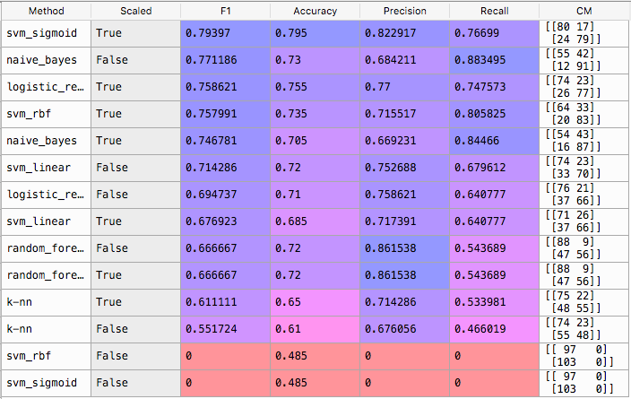
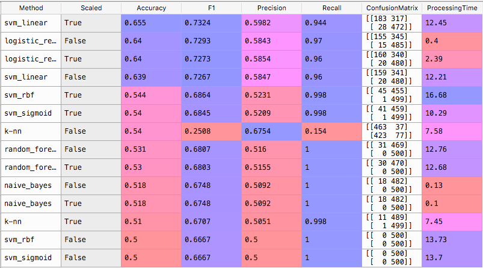

# NLP Bag of Words
## Fun with traditional ML algorithms

1000 restaurant customer reviews are classified as 1 or 0, "Liked" or "Didn't like".
Reviews are trimmed, removing most common words, and common words/verbs (Like, Liked, Liking) are grouped together to get a more consistent result ("stemming")
The result is grouped into a rough "Bag of Words", and processed with "traditional" ML techniques to predict ratings on a test set of 200 reviews.
Results are grouped in a table, sorted by descending F1 score. 

The most effective algorithms in this case are SVM with a sigmoid kernel with feature scaling, then Naive Bayes without scaling
To review the results, open the df_results after the script has run

## Algorithms:
* SVM (Kernels linear, sigmoid, rbf)
* Naive Bayes
* K-NN
* logistic regression

Based on an exercise of ML A-Z on Udemy (Superdatascience)

## Surprising results
The SVM algorithm with RBF kernel is both best and worst in class. With feature scaling, it achieves the best result with 79% accuracy. Without scaling, it's broken and always predicts 0 (Didn't like) values, as shown in the confusion matrix.
Some methods work better on a scaled matrix, other prefer the unscaled version.


## Conclusion
Almost 80% accuracy after training on a sample of 800 reviews, is surprisingly good!! Specially with a bag of words not taking into account the order of words in each review.
Now, that'd be nice to achieve a better accuracy, like 90%.

## Phase 2: Next step!
So my plan was to turbocharge it and train on a bigget dataset of 82000 reviews, like this one on [Kaggle](https://www.kaggle.com/c/restaurant-reviews/data "Restaurant reviews")
As it turned out, it was not a great idea! (but I learned a lot on the way)

The second dataset, had roughly 82000 lines, and scores between 1 and 5.
The initial idea, was to set 1-2 values to 0, and 4-5 to 1. 3 are discarded as they can't really be considered as "Liked" or not.
Doing so, it was quite an interesting exercise trying different configurations (more words in the vocabulary, or less), different sizes

### Typical results
Results after training on 5000 observations of the second dataset, and testing on 1000 observations of the first one

```
####################
START ML_LOOP
training set size: 5000
test set size: 1000
vocabulary: 1000 

METHODS: logistic_regression k-nn naive_bayes random_forest svm_linear svm_rbf svm_sigmoid 
SCALING: [False, True] 

METHOD               SCALED     F1         ACCURACY   PROCESSING_TIME
logistic_regression  False      0.7293     0.64       0.4
k-nn                 False      0.2508     0.54       7.58
naive_bayes          False      0.6748     0.518      0.13
random_forest        False      0.6807     0.531      12.76
svm_linear           False      0.7267     0.639      12.21
svm_rbf              False      0.6667     0.5        13.73
svm_sigmoid          False      0.6667     0.5        13.7

SCALING DONE
logistic_regression  True       0.7273     0.64       2.39
k-nn                 True       0.6707     0.51       7.45
naive_bayes          True       0.6748     0.518      0.1
random_forest        True       0.6803     0.53       12.68
svm_linear           True       0.7324     0.655      12.45
svm_rbf              True       0.6864     0.544      16.68
svm_sigmoid          True       0.6845     0.54       10.29

END ML_LOOP
####################
TOTAL CPU TIME: 122.8
```
## Lessons learned

### Test on the right dataset!
My initial mistake was to train and test the classifiers on a mix of both datasets. This lead to very surprisingly good results!
But it was not representative of the performance on the initial test set, what actually really mattered.

### Sparsity is a problem
The matrix after tokenization is definitely very sparse. The matrix size is HUGE compared to the information it contains. The information density is very low.
This is a serious performance problem, as each cell has to be processed, whether it contains a dumb 0 or not.
Applying feature scaling changed the 0s by many mean values, but the information density was still the same (appalling).

### System Performance 
The matrix size is basically training set size * vocabulary size. So it could vary from 1000 x 1000 (1 million cells) to 50'000 x 18'000 (900 millions cells!) depending on encoding choices.
Scripts happened to run quite long. So I added printing to get intermediate results during the processing.
After many runs, it got nicer and nicer as it was my main tool to evaluate results.

First, running with around 18K words and not so small datasets, it took around 25 minutes to process all the methods.
Then I started logging the times (a very interesting information BTW) and printing results after each new prediction.

Unfortunately, the system performance could not really be improved, as I was mainly using standard fitting functions of traditional algorithms.
Trying to writing them in Python was not an option (Python per se is awfully slow), and their implementation in C/C++ was definitively better than what I could have done myself.

### Experiment conclusions
After many tries, I came to the conclusion that using this new dataset was doing more harm than good.
- Performance in the best cases, the F1 score was quite average, and the accuracy unsatisfying, specially taking into account the much higher training set size and longer processing time.
The performance was much better when training classifiers with only a part of the initial smaller dataset!
- One interesting fact, one of the most simple approaches, logistic regression, was always the fastest and generally with the best performance (most runs in a fraction of a second, 1000 times faster than others).
- Naive Bayes also had a decent result, specially considering the speed of this algorithms. It really makes sense to use it considering its performance.

### Dataset quality
Finally, I compared the data distribution:
- Liked scores: the fist dataset had a relatively higher mean (0.67 vs 0.5) and smaller standard deviation (0.3 vs 0.5)
Basically, the initial dataset was very extreme in its values
- The second dataset reviews were much longer with a lot more vocabulary.
That seemed to be OK, considering the principle of transfer learning for Computer Vision problem.
That's when a CNN is trained on a huge dataset, then can be adapted to a very specific problem with a much smaller dataset.
It happened in this case not to work, as the datasets were too different. I trained the classifiers on a dataset, and tested it on a too different one.

So the naive assumption that training ML classifiers on bigger dataset would automatically bring better results, was indeed very naive.
The dataset quality counts a lot!

### Test evaluation
I first used F1 score to select the best classifiers. As the class distributions are quite balanced (kind of 40-60%), the accuracy is actually the good one to take.

## Phase 3
After quite a few tries and improvmements, scripts are now a bit cleaner, sparse matrices are used for specific 
4 algorithms have been long-listed, from which 2 algorithms have been retained:
- naive_bayes, svm_sigmoid due to their initial good performance on the original dataset
- logistic_regression, svm_linear as they showed quite some correct performance after training on the second bigger dataset
At the end, the best algorithms on the initial dataset, were pretty average on the new dataset. Logistic regression and SVM linear showed the best results, depending on the training dataset and vocabulary sizes. Logistic Regression is by far the fastest, the execution time is always extremely fast (most likely logarithmic or linear + a bias, this should be checked).
Scaling features affects a bit the results, but not in an extreme way. Overall, the execution is slower on the scaled vector.
The SVM linear seems to ahve a O(n3) asymptotic complexity.


## TODO
- clean up the code after a lot of small changes.

## Next steps for improvement
Basically, potential tracks for improvements would be
1. Re-train on 800 of the first dataset + 5000-20'000 of the second one and check the results
2. Find a relevant dataset with a good quality, and similar scale/distribution as the initial one.
3. Automate the test with different values of vocabulary size, and dataset size, store the results into a list of dataframes, and extract out of it the most promising accuracies and F1 scores
4. Try different a fully different approach of bag of words: 2-grams or 3-grams would be promising
5. Of course the RNN NLP way: a simple recurrent neural network (RNN), next step with GRU cells.
